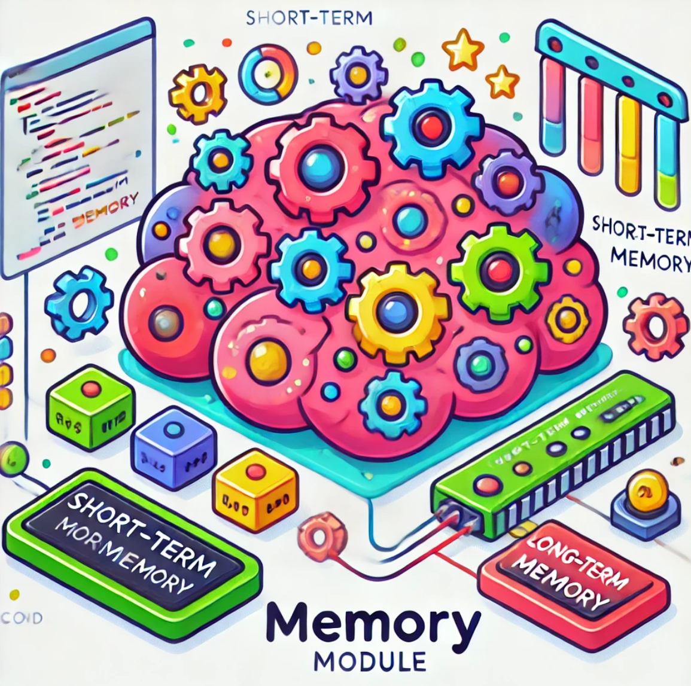

# Memory Submodule

## Overview

The memory submodule is an integral part of the **Autonomous Software Development System**, providing a robust and high-performance memory management framework. This module leverages **Pandas DataFrames** and **embeddings** to ensure fast and reliable memory storage and retrieval. Designed with flexibility in mind, it supports accelerated embeddings via **CUDA** and **OpenVINO**, as well as a basic embedding mechanism for environments without hardware acceleration.



## Key Features

- **Hybrid Memory Architecture**: Efficiently handles short-term and long-term memory, allowing both quick recalls and deep memory searches.
- **Embedding-Based Search**: Uses high-dimensional embeddings to perform similarity searches, enabling accurate and contextually aware memory retrieval.
- **Hardware Acceleration Options**:
  - **CUDA**: Accelerated embeddings with CUDA for fast computations on NVIDIA GPUs.
  - **OpenVINO**: Optimized inference using Intel hardware for systems supporting OpenVINO.
- **Pandas-Backed Storage**: Fast, scalable storage using Pandas DataFrames ensures that even large datasets can be searched efficiently.

## Why Pandas and Embeddings?

We chose **Pandas DataFrames** for their:
- **Speed**: Pandas provides fast, in-memory data manipulation, which is crucial when storing and retrieving large volumes of memory data.
- **Flexibility**: The DataFrame format makes it easy to store and search memory using multiple indexing methods, such as embeddings or text-based TF-IDF searches.

We opted for **embeddings** to:
- **Enhance Search Robustness**: Embeddings capture semantic meaning, making it possible to retrieve memory based on contextual similarity rather than exact keyword matches.
- **Enable Accelerated Search**: By utilizing vectorized embeddings, we can leverage high-performance libraries (like **scikit-learn**) to perform fast cosine similarity searches.

## Memory Types

### 1. **SimpleMemory (simple.py)**

A basic implementation of memory using Pandas DataFrames for storing user input and system responses. This memory class supports both short-term and long-term storage with text-based search using TF-IDF.

- **Use case**: Simple environments where embeddings or acceleration are not required.

### 2. **EmbeddedMemory (embedded.py)**

Uses embeddings for both short-term and long-term memory storage. Memory is represented as high-dimensional vectors, and searches are performed using cosine similarity to retrieve contextually relevant memories.

- **Use case**: Scenarios where a robust, embedding-based search is needed, but without hardware acceleration.

### 3. **CudaMemoryWithEmbeddings (cuda_embedded.py)**

Leverages **CUDA** to accelerate embedding generation and memory searches. This implementation is optimized for NVIDIA GPUs, using libraries like **Torch** and **FlashAttention** to maximize speed.

- **Use case**: High-performance environments where speed and scalability are critical.

### 4. **OpenvinoMemoryWithEmbeddings (ov_embedded.py)**

Uses **OpenVINO** for accelerated embedding generation on Intel hardware. This implementation is tailored for CPUs and Intel GPUs, optimizing performance for inference using ONNX models.

- **Use case**: Systems with Intel hardware, where OpenVINO can be utilized for fast inference.

## Search Capabilities

All memory types support powerful search capabilities:
- **Cosine Similarity Search**: For embedding-based searches, cosine similarity is used to find the most contextually similar memories.
- **Text-Based Search**: In the case of **SimpleMemory**, searches are performed using a TF-IDF-based approach to find the best matching memories.

Example of embedding search:

```python
# Example of searching with embedding-based memory
results = memory.search_memory("What was my last command?", long_term=True, top_n=5)
print(results)
```

## Integration with LangChain

This memory module is built on top of **LangChain's BaseMemory**, allowing seamless integration into systems that use LangChain for LLM orchestration. The memory classes inherit from `BaseMemory`, enabling easy extension and customization for specific needs. This design choice ensures that the memory module can fit into a wide variety of architectures and workflows, enhancing flexibility and interoperability.

## Use Cases

- **Agentic Systems**: Perfect for systems that need to recall past interactions with contextual relevance, such as chatbots, virtual assistants, and autonomous software development systems.
- **Autonomous Software Development**: Embeddings help agents recall prior development steps or decisions, streamlining tasks like debugging, refactoring, or feature additions.

## License

This submodule is part of the larger **Autonomous Software Development System** and is licensed under the **GNU General Public License v3.0**.
