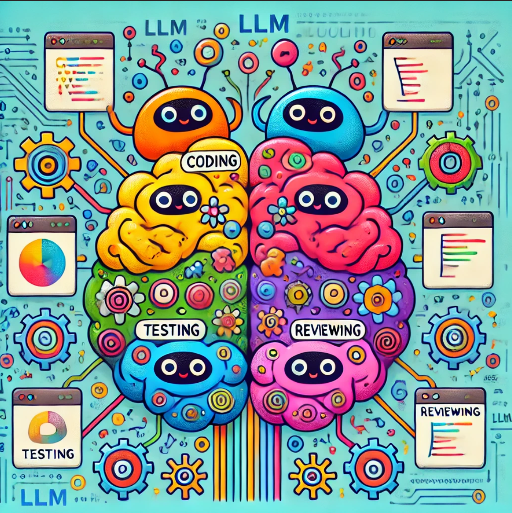

# Brain Module

## Overview

The **Brain module** is a core part of the autonomous software development system. It orchestrates decision-making using multiple lobes, each specialized in different aspects of memory recall, reasoning, and problem-solving. The brain dynamically selects whether to use tools, interact with lobes, or recall memories from its integrated memory system to process user inputs efficiently.




### Key Components

- **Brain Class**: Central class managing lobes, tools, and memory retrieval. It interacts with different parts of the system to decide how to handle user inputs.
- **Memory Submodule**: Handles short-term and long-term memory using various embedding techniques such as CUDA, OpenVINO, and embedded memory.

## Lobes

The brain is composed of several lobes, each responsible for specific tasks:

1. **PreFrontalCortex**: Reflexive thinking and decision-making, serving as the control center.
2. **Frontal Lobe**: Higher-level thinking, reasoning, and complex decision-making.
3. **Occipital Lobe**: Pattern recognition and visual information processing.
4. **Temporal Lobe**: Language comprehension, memory recall, and auditory processing.
5. **Parietal Lobe**: Mathematical reasoning, spatial awareness, and problem-solving.
6. **Cerebellum**: Quick reflexive actions with minimal reasoning.
7. **Broca’s Area**: Focuses on conversational and structured speech generation.
8. **Amygdala**: Responsible for emotional response and sentiment analysis.
9. **Cerebral Cortex**: General problem-solving across various domains.
10. **Hippocampus**: Maintains long-term memory and continuity.

### Brain Class

The `Brain` class dynamically interacts with its lobes and memory to determine the best course of action when processing inputs.

- **Lobe System**: Lobes interact with each other and the memory to generate meaningful responses.
- **Toolkits**: The brain can use external tools (e.g., web scraping, mathematical calculations) to answer specific queries. The brain determines whether to use a tool or a lobe based on the input.
- **Memory Types**:
  - **CUDA**: For systems with NVIDIA GPUs to accelerate memory embeddings.
  - **OpenVINO**: For Intel-based systems using ONNX models.
  - **Embedded**: For lightweight, built-in memory systems.

### Memory Submodule

The brain uses memory for efficient retrieval of past interactions and knowledge. This includes both short-term and long-term memory.

- **Hippocampus**: Specialized in retrieving long-term memory, leveraging either embedded search or other optimized search algorithms based on the configuration.
  
The memory submodule supports different backends:
- **CUDA-based** for GPU acceleration.
- **OpenVINO** for Intel hardware acceleration.
- **Embedded** memory for general-purpose use.

## How it Works

When a user input is provided, the **PreFrontalCortex** (or a designated lobe) processes the input and decides whether to:
1. Use a **tool** (e.g., for performing calculations, fetching a webpage).
2. Use a specific **lobe** (e.g., for problem-solving, memory recall).
   
The brain's architecture ensures that inputs are routed efficiently between the tools and lobes. The brain can also store interactions in its memory for future reference.

### Example Input Processing

An example input might be:

- **Input**: "What is the capital of France?"
- **Decision**: The PreFrontalCortex determines that this is a simple factual query and directs the brain to use the Temporal Lobe for language comprehension and recall.

Alternatively:
- **Input**: "Calculate 5 + 5"
- **Decision**: The brain decides to use the `calculate` tool to handle the arithmetic problem.

### Installation

To use the brain module, include it in your project setup:

1. **Install the dependencies** (use the main project’s installation steps to handle `torch`, `langchain`, etc.)
2. Import the `Brain` class in your code and initialize it:
   ```python
   from agents.brain.core import Brain
   brain = Brain(toolkit=my_toolkit)
   ```

### Available Functions in Brain

- **`process_input(user_input: str) -> str`**: Processes user input and returns the generated response, either using tools or lobes.
- **`determine_action(user_input: str) -> dict`**: Determines if an input should be handled by a tool or a lobe and returns the action details.
- **`store_memory(user_input: str, response: str)`**: Stores the interaction (user input and response) into memory.
- **`use_tool(user_input: str, tool_index: int) -> str`**: Executes the selected tool based on the processed input.

### Memory Integration

The brain uses memory as a key component in interaction processing:
- **Short-term memory**: Used for quick, reflexive tasks and immediate context recall.
- **Long-term memory**: Stored and retrieved using embedding techniques (via CUDA, OpenVINO, or embedded methods).

### Examples of Lobe Usage

The lobes within the brain are designed for different reasoning tasks:
- **PreFrontalCortex**: The control center for decision-making and task allocation. Uses GPT-4o-mini models for reflexive thinking.
- **Frontal Lobe**: Ideal for complex decision-making and higher-order thinking tasks. Uses GPT 4o models for complex reasoning.

