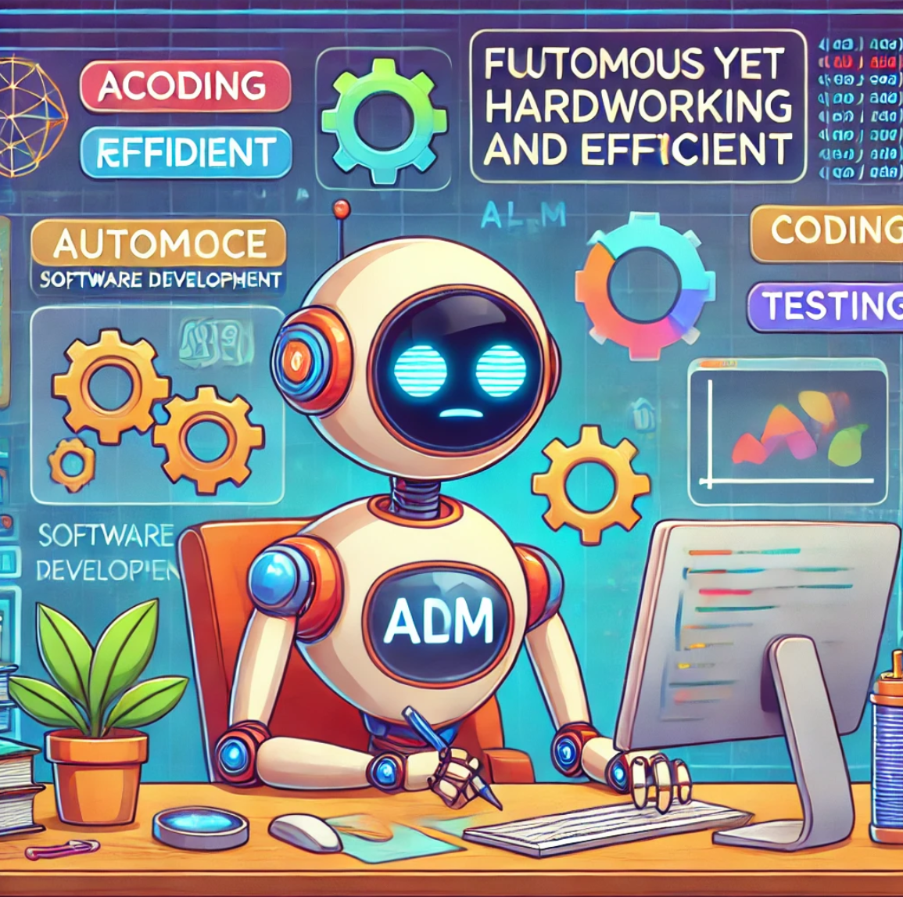
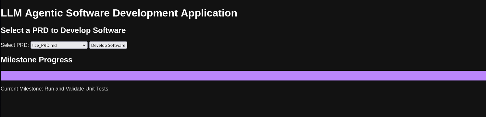
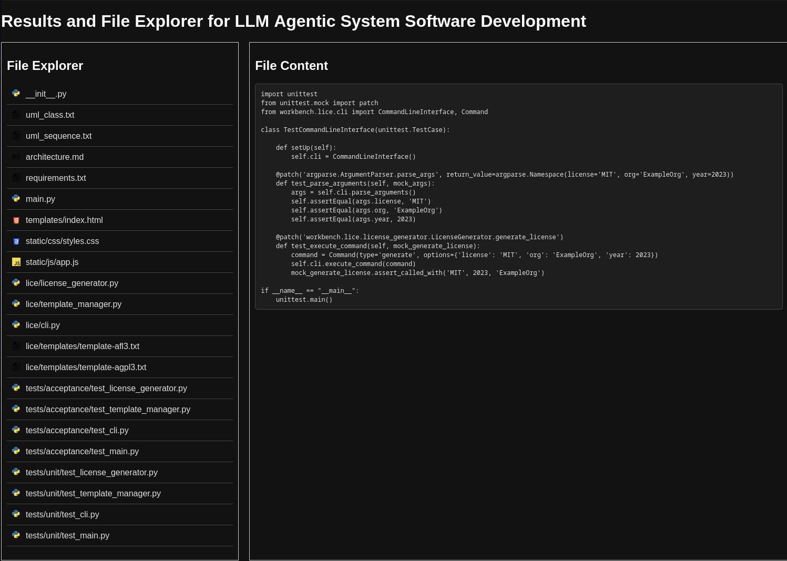

# LLM Agentic System for Software Development



## Overview

The **LLM Agentic System for Software Development** is an advanced, autonomous system designed to streamline software development. Using Large Language Models (LLMs), the system dynamically interprets input from a Product Requirements Document (PRD) and progresses through various milestones to develop, test, and validate software automatically. This project is a collaboration of advanced agentic AI techniques, making it capable of end-to-end software development.

## Features

- **Autonomous Development**: Agents progress through predefined milestones to complete the development cycle.
- **Interactive Interface**: A Flask-based UI to manage and monitor the development process.
- **Modular Design**: Includes multiple brain models (`code_brain`, `cognitive_brain`) tailored for specific tasks.
- **Acceptance and Unit Testing**: Generates and validates tests autonomously.
- **Visualization and Reporting**: Monitors milestones and provides detailed logs of the process.

---

## System Architecture

### Brains

- **Core Brain (`core.py`)**: The foundational module for all brain implementations. Manages memory, tools, and the goal system. It supports modularity and extensibility.
- **Code Brain (`code_brain_model.py`)**: Inherits the core functionality to specialize in interpreting PRDs, UML diagrams, and generating Python-based software solutions.
- **Cognitive Brain (`cognitive.py`)**: Designed for cognitive decision-making and complex problem-solving tasks. [Future development planned].

### Milestones

The system operates through the following milestones:
1. **UML and Architecture Design**: Parses and validates UML diagrams and architecture documents.
2. **Environment Setup**: Configures a virtual Python environment for development.
3. **Code Implementation**: Uses the PRD, UML, and architecture to generate code.
4. **Acceptance Testing**: Generates and validates acceptance tests based on requirements.
5. **Unit Testing**: Creates and runs unit tests for individual components.

Each milestone is modular, allowing for independent testing and debugging.

---

## Installation

### Requirements

Ensure Python 3.10+ is installed on your system.

```bash
pip install -r requirements.txt
```

### Additional Setup

1. Create the necessary folders:
   ```bash
   mkdir prd workbench
   ```

2. Populate the `prd` folder with PRD files to initiate development.

---

## Usage

### 1. CLI Mode

To use the CLI mode, run the following:

```bash
python main.py
```

### 2. Flask Web Interface

The web interface allows you to select a PRD, track progress, and view results.

Start the Flask app:
```bash
python flask_app.py
```

Navigate to [http://localhost:5000](http://localhost:5000) to access the interface.

---

## Components

### Flask Interface

The UI provides:
- Dropdown for PRD selection.
- Real-time milestone tracking with a progress bar.
- File explorer and viewer for generated files.

### Milestones

Each milestone leverages the brain's capabilities:
- **Environment Setup**: Automatically installs required dependencies.
- **Code Implementation**: Generates code for the selected PRD.
- **Testing**: Validates functionality through generated tests.

### Tools

Integrated tools include:
- Virtual environment management.
- Acceptance and unit test execution.
- Syntax highlighting for generated files in the web UI.

---

## Example Workflow

1. **Select PRD**: Upload or select a PRD file from the web interface.
2. **Track Progress**: Monitor milestone completion in real-time.
3. **View Results**: Explore generated files, including UML diagrams, architecture designs, and code.

---

## Development Notes

### Modular Design

The `code_brain_model` inherits functionality from `core.py`, ensuring a consistent structure across different brain implementations. 

### Core Functionality (`core.py`)

The `core.py` manages:
- **Memory**: Tracks progress and stores relevant data.
- **Goals**: Defines milestones and their associated tasks.
- **Toolkits**: Integrates tools like virtual environments and code execution.

### Code Brain

The `code_brain_model.py` extends the `core.py` to handle:
- Parsing UML and PRD documents.
- Generating Python files.
- Integrating testing and validation.

---

## Future Enhancements

- Extend the **Cognitive Brain** for multi-agent collaboration.
- Implement AI-based error correction and optimization for generated code.
- Add support for additional programming languages.

---
## Screenshots

### Web Interface


### Results


___

## Contributors

- **Josh Gompert**
- **Nathan Smith**
- **Kruti Shah**

---

## License

This project is licensed under the GPL-3.0 License. See the LICENSE file for details.

---

